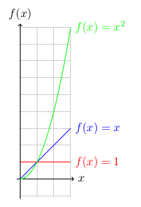

# Data Structures Tutorial

## I. Welcome

Data structures are ways of organizing code in ways that increase efficiency. They are often used when organizing or looking through large amounts of data.

The way in which the efficiency is measured is using the Big O notation. What this does is looks at the worse case scenario of how long it could take to look through the data, and reduces it to the following measurements:

* O(1) - This is the most efficient method. It will take the same amount of time each time. It is constant, represented with the red line.
* O(n) - This depends on the variable with how long it would take. It is linear, represented with the blue line. 
* O(n²) - This will take the variable and multiply it with itself, taking much longer with larger variables. It is exponential, represented with the green line. 

The x-axis represents the data size, and the y-axis represents how much time it could take (based on the worst case scenario).

This tutorial will cover three common data structures used in programming, and their respective Big O notations. 

## II. Queue

The queue data structure is very basic. It uses the rule of FIFO (First In, First Out). Every time something is added into the list of data, it is added to the back. Every time something is taken from the data, it is taken from the front. 

You have likely seen this used when listening to music. Typically when you add a song to the queue while you are listening to music, it adds it to the back end of the queue (unless of course you have a shuffle mode on, or specify the order yourself). The song that plays next is not the one that was most recently added, it is the one that has been waiting the longest. 

See [this example](https://github.com/danieljcross/data_struct/tree/master/fa24-final-project-danieljcross-main/ds1-example) of how this could be coded in C#. 

Big O: O(1)

Adding a song to the end of the queue has no dependancy on the number of songs in the list, so it will have the same efficiency no matter how many songs are in the list. 

Your task:

A hamburger restaurant wants to implement a FIFO rule so that there isn't one customer waiting longer for their food than others. They want to do this by serving customers in the same order in which they paid for their food. Update [Problem 1](https://github.com/danieljcross/data_struct/tree/master/fa24-final-project-danieljcross-main/ds1-problem) with your solution. 

Once you have completed, please compare your answer with the [Sample Solution](https://github.com/danieljcross/data_struct/tree/master/fa24-final-project-danieljcross-main/ds1-solution) before submitting a link to your personal GitHub repository. 

## III. Set or Linked List *(pick one)*

* Introduction
* ...
* *(replace these lines with headings that you'd use to teach this data structure)*
* ...
* Efficiency of common operations
* Example Problem
* Problem to Solve

## IV. Tree

* Introduction
* ...
* *(replace these lines with headings that you'd use to teach this data structure)*
* ...
* Efficiency of common operations
* Example Problem
* Problem to Solve